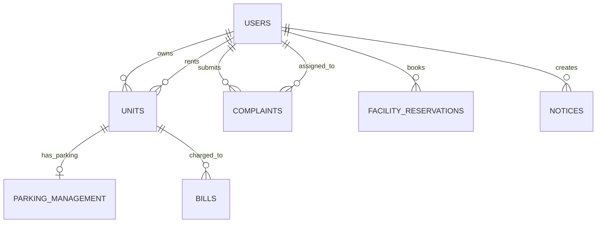

# Apartment Management System (AMS) - Technical Documentation

Welcome to the technical documentation for the **Apartment Management System (AMS)**. This document provides a comprehensive, easy-to-understand breakdown of the project's technology stack, architecture, database design, API endpoints, and role-based access control system.

---

## 1. Project Overview & Architecture

The Apartment Management System (AMS) is a full-stack, client-server web application designed to streamline interactions between property administrators, staff, maintenance crews, homeowners, and tenants.

### High-Level Architecture

The system follows a classic **Three-Tier Architecture**:
1. **Presentation Layer (Frontend)**: A React-based Single Page Application (SPA) styled with Tailwind CSS and bundled using Vite. It communicates with the backend via RESTful HTTP requests.
2. **Application Layer (Backend)**: An Express/Node.js API server that handles business logic, authorization, routing, and processes requests from the client.
3. **Data Layer (Database)**: A relational MySQL database containing tables for users, apartment units, bills, notices, complaints, and facility reservations.

```mermaid
graph TD
    subgraph Client Layer (Frontend)
        A[React SPA / Vite] -->|Axios REST Requests| B(JWT Auth Header)
    end

    subgraph Application Layer (Backend)
        B --> C[Express API Server]
        C --> D[Auth Middleware]
        C --> E[Routes & Controllers]
    end

    subgraph Data Layer (Database)
        E -->|mysql2/promise Pool| F[(MySQL Database)]
    end
```

---

## 2. Technology Stack

### Frontend (Client-Side)
*   **React (v19.x)**: UI library utilizing a component-based model.
*   **Vite**: Next-generation frontend build tool and development server providing fast HMR (Hot Module Replacement).
*   **Tailwind CSS (v4.x)**: Utility-first CSS framework for custom responsive styling.
*   **React Router DOM (v7.x)**: For client-side routing, navigation, and page management.
*   **Axios**: Promise-based HTTP client for making API requests to the backend. Includes an interceptor to automatically attach JWT authorization headers.
*   **Lucide React**: Vector icons set used across all dashboards.

### Backend (Server-Side)
*   **Node.js**: JavaScript runtime environment.
*   **Express (v4.x)**: Fast, unopinionated web framework used to design the REST API routing.
*   **mysql2**: MySQL client supporting promises, used with connection pooling for performant database operations.
*   **JSON Web Token (JWT)**: Used for stateless session management and security.
*   **BcryptJS**: Used for securely hashing user passwords before database storage.
*   **Dotenv**: Zero-dependency module that loads environment variables from a `.env` file.

### Database
*   **MySQL Server**: Relational Database Management System (RDBMS) storing application state, configurations, and relationships.

---

## 3. Database Schema Design

The database schema consists of **7 primary tables** with foreign key constraints establishing relationships.



### Table Details

#### 1. `users`
Stores user profile information, authentication credentials, and user roles.
*   `id` (INT, PK, Auto Increment)
*   `email` (VARCHAR(255), Unique, Not Null)
*   `password_hash` (VARCHAR(255), Not Null)
*   `role` (ENUM: `'admin'`, `'staff'`, `'maintenance'`, `'homeowner'`, `'tenant'`, Not Null)
*   `status` (ENUM: `'pending'`, `'approved'`, `'rejected'`, Default: `'pending'`)
*   `owner_id` (INT, FK -> `users.id`, Nullable) - Used by tenants to associate with their landlord.
*   `owner_approved` (TINYINT(1), Default: `0`) - Flag showing if the landlord approved this tenant.
*   `full_name`, `nic_or_passport`, `phone_number`, `building_name`, `unit_number`, `vehicle_number`, `relationship_to_owner` (Profile details)
*   `created_at` (TIMESTAMP)

#### 2. `units`
Represents physical apartment units in the complex.
*   `id` (INT, PK, Auto Increment)
*   `block_name` (VARCHAR(50), Not Null)
*   `floor_number` (INT, Not Null)
*   `unit_number` (VARCHAR(50), Not Null)
*   `owner_id` (INT, FK -> `users.id`, Null)
*   `tenant_id` (INT, FK -> `users.id`, Null)
*   `parking_slot_id` (INT, FK -> `parking_management.id`, Null)
*   *Unique Key*: `(block_name, floor_number, unit_number)` to prevent duplicates.

#### 3. `parking_management`
Manages permanent and guest parking slots.
*   `id` (INT, PK, Auto Increment)
*   `unit_id` (INT, FK -> `units.id`, Null)
*   `slot_number` (VARCHAR(50), Unique, Not Null)
*   `type` (ENUM: `'permanent'`, `'guest'`, Not Null)
*   `guest_date` (DATE, Null) - Reserved date if booking a guest spot.
*   `status` (ENUM: `'active'`, `'pending'`, `'approved'`, `'rejected'`, Default: `'active'`)
*   `created_at` (TIMESTAMP)

#### 4. `complaints`
Tracks issues or maintenance requests submitted by residents.
*   `id` (INT, PK, Auto Increment)
*   `user_id` (INT, FK -> `users.id`, Not Null) - Reporter
*   `category` (VARCHAR(100), Not Null) (e.g., Plumbing, Electrical)
*   `description` (TEXT, Not Null)
*   `priority` (ENUM: `'low'`, `'medium'`, `'high'`, Default: `'medium'`)
*   `status` (ENUM: `'pending'`, `'in_progress'`, `'resolved'`, Default: `'pending'`)
*   `assigned_staff_id` (INT, FK -> `users.id`, Null) - Assigned maintenance technician
*   `created_at` (TIMESTAMP)

#### 5. `facility_reservations`
Handles bookings for common amenities (e.g., gym, pool, clubhouse).
*   `id` (INT, PK, Auto Increment)
*   `user_id` (INT, FK -> `users.id`, Not Null)
*   `facility_name` (VARCHAR(100), Not Null)
*   `date` (DATE, Not Null)
*   `status` (ENUM: `'pending'`, `'approved'`, `'rejected'`, Default: `'pending'`)
*   `created_at` (TIMESTAMP)

#### 6. `notices`
Broadcast board for management notices and community updates.
*   `id` (INT, PK, Auto Increment)
*   `title` (VARCHAR(255), Not Null)
*   `content` (TEXT, Not Null)
*   `created_by` (INT, FK -> `users.id`, Not Null)
*   `created_at` (TIMESTAMP)

#### 7. `bills`
Invoices for water, electricity, or general maintenance.
*   `id` (INT, PK, Auto Increment)
*   `unit_id` (INT, FK -> `units.id`, Not Null)
*   `amount` (DECIMAL(10,2), Not Null)
*   `description` (VARCHAR(255), Not Null)
*   `due_date` (DATE, Not Null)
*   `status` (ENUM: `'unpaid'`, `'paid'`, Default: `'unpaid'`)
*   `created_at` (TIMESTAMP)

---

## 4. File and Directory Structure

The repository is cleanly divided into separate backend and frontend projects.

```
KDU_P1111_Apartment_Management_System/
│
├── SETUP.md                     # Initial local setup instructions
├── TECHNICAL_DOCUMENTATION.md   # Current document (System Architecture & details)
│
├── backend/                     # Express Node.js Backend Server
│   ├── config/
│   │   └── db.js                # MySQL2 Connection Pool setup
│   ├── controllers/             # Business Logic Handlers
│   │   ├── authController.js    # Auth, Approvals, Profile, Stats
│   │   ├── billController.js    # Invoice management
│   │   ├── complaintController.js # Complaint assignment and tracking
│   │   ├── facilityController.js  # Amenity reservations
│   │   ├── noticeController.js    # Notice board publishing
│   │   ├── parkingController.js   # Parking slot operations
│   │   └── unitController.js      # Apartment unit setup and assignments
│   ├── db/
│   │   ├── migration.sql        # Database tables construction
│   │   └── seed.js              # Seed data populator for development
│   ├── middleware/
│   │   └── authMiddleware.js    # JWT token validation & role checkers
│   ├── routes/                  # Express REST Endpoint routes
│   │   ├── authRoutes.js
│   │   ├── billRoutes.js
│   │   ├── complaintRoutes.js
│   │   ├── facilityRoutes.js
│   │   ├── noticeRoutes.js
│   │   ├── parkingRoutes.js
│   │   └── unitRoutes.js
│   ├── .env.example             # Template for local configurations
│   ├── package.json             # Backend dependencies list
│   └── server.js                # App entrypoint & middleware registrations
│
└── frontend/                    # Vite + React Frontend Client
    ├── public/                  # Static assets
    ├── src/
    │   ├── assets/              # Icons and custom design materials
    │   ├── components/          # Segregated Role-Based Dashboards
    │   │   ├── Admin/
    │   │   │   └── AdminDashboard.jsx    # Unified dashboard for Admin & Staff
    │   │   ├── Layout/
    │   │   │   └── Navbar.jsx            # Shared Navigation bar
    │   │   ├── Maintenance/
    │   │   │   └── MaintenanceDashboard.jsx # Work Order tracker for Maintenance
    │   │   └── Resident/
    │   │       └── ResidentDashboard.jsx # Homeowner/Tenant portal (Bills, complaints, bookings)
    │   ├── context/
    │   │   └── AuthContext.jsx  # Global Authentication, Login, Register, Logout State
    │   ├── pages/               # Routing View Components
    │   │   ├── Dashboard.jsx    # Dynamic Dashboard redirector based on roles
    │   │   ├── Login.jsx        # Login Screen
    │   │   ├── Register.jsx     # Registration Screen (Homeowners / Tenants / Staff / Techs)
    │   │   └── NotFound.jsx     # 404 page
    │   ├── App.css
    │   ├── App.jsx              # Main App React-Router declaration
    │   ├── index.css            # Tailwind Imports & Global CSS styles
    │   └── main.jsx             # DOM mounting entrypoint
    ├── tailwind.config.js       # Styling configuration
    └── package.json             # Frontend libraries and build tasks
```

---

## 5. API Reference

All requests to protected routes must include the authorization header: `Authorization: Bearer <jwt_token>`.

### Authentication & Users
| Method | Endpoint | Access | Purpose |
| :--- | :--- | :--- | :--- |
| `POST` | `/api/auth/register` | Public | Register a new user with a specific role |
| `POST` | `/api/auth/login` | Public | Sign in and retrieve JWT token |
| `GET` | `/api/auth/homeowners` | Public/Register | Fetch approved homeowners (needed for tenant linking) |
| `GET` | `/api/auth/pending-approvals` | Admin / Staff | Get list of user registrations waiting for approval |
| `POST` | `/api/auth/approve` | Admin / Staff | Approve or reject a user registration |
| `GET` | `/api/auth/admin-dashboard-stats` | Admin / Staff | Retrieve total statistics for Admin Dashboard summary |
| `GET` | `/api/auth/residents` | Admin / Staff | Get all registered homeowners and tenants |
| `GET` | `/api/auth/resident-dashboard-stats`| Resident / Tenant | Get personal metrics (unpaid bills, bookings, complaints) |
| `PUT` | `/api/auth/profile` | Auth Users | Update personal profile details (Phone, Vehicle, Name) |

### Apartment Units
| Method | Endpoint | Access | Purpose |
| :--- | :--- | :--- | :--- |
| `GET` | `/api/units` | Admin / Staff | List all apartment units along with owners & tenants |
| `POST` | `/api/units` | Admin / Staff | Create a new unit |
| `PUT` | `/api/units/:id` | Admin / Staff | Edit unit details or update owner/tenant associations |
| `DELETE`| `/api/units/:id` | Admin / Staff | Delete an apartment unit |

### Complaints (Maintenance Requests)
| Method | Endpoint | Access | Purpose |
| :--- | :--- | :--- | :--- |
| `GET` | `/api/complaints` | Authenticated | View complaints (Residents view own; Staff/Maintenance view all) |
| `POST` | `/api/complaints` | Resident / Tenant | File a new complaint/maintenance request |
| `PUT` | `/api/complaints/:id` | Staff / Maintenance| Update complaint status, priority, or assign technician |
| `DELETE`| `/api/complaints/:id` | Admin / Staff | Remove a complaint entry |

### Facilities (Bookings)
| Method | Endpoint | Access | Purpose |
| :--- | :--- | :--- | :--- |
| `GET` | `/api/facilities/reservations`| Authenticated | View reservations (Residents view own; Admin/Staff view all) |
| `POST` | `/api/facilities/reserve` | Resident / Tenant | Request a facility reservation |
| `PUT` | `/api/facilities/reservations/:id` | Admin / Staff | Approve or reject a facility booking request |

### Parking Management
| Method | Endpoint | Access | Purpose |
| :--- | :--- | :--- | :--- |
| `GET` | `/api/parking` | Authenticated | View parking spots (Permanent & Guest) |
| `POST` | `/api/parking/allocate` | Admin / Staff | Allocate/Assign a permanent slot to an apartment unit |
| `POST` | `/api/parking/guest` | Resident / Tenant | Request a guest parking space for a specific date |
| `PUT` | `/api/parking/guest/:id` | Admin / Staff | Approve or reject guest parking requests |

### Notices & Announcements
| Method | Endpoint | Access | Purpose |
| :--- | :--- | :--- | :--- |
| `GET` | `/api/notices` | Authenticated | Fetch notices for the dashboard |
| `POST` | `/api/notices` | Admin / Staff | Publish a new community notice/announcement |
| `DELETE`| `/api/notices/:id` | Admin / Staff | Delete a notice |

### Utility & Maintenance Bills
| Method | Endpoint | Access | Purpose |
| :--- | :--- | :--- | :--- |
| `GET` | `/api/bills` | Authenticated | View bills (Residents view their unit's bills; Admin/Staff view all) |
| `POST` | `/api/bills` | Admin / Staff | Issue a new bill to an apartment unit |
| `PUT` | `/api/bills/:id/pay` | Resident / Staff | Pay/Mark bill status as Paid |

---

## 6. Access Control (RBAC) & Router Protection

The system implements Role-Based Access Control (RBAC) across both frontend views and backend API routes:

### 1. Route Protection (Frontend)
In `frontend/src/App.jsx`:
*   `ProtectedRoute`: Validates if the user is authenticated. If the JWT is expired or missing, redirects to `/login`.
*   `AuthRoute`: Prevents logged-in users from returning to the `/login` or `/register` screens (automatically pushes them back to `/dashboard`).
*   `Dashboard Router Redirect`: Inside `frontend/src/pages/Dashboard.jsx`, the app reads the user's role and serves the appropriate dashboard components (`AdminDashboard`, `MaintenanceDashboard`, or `ResidentDashboard`).

### 2. Role-Based Permissions Summary

| Feature Area | Admin | Staff | Maintenance | Homeowner | Tenant |
| :--- | :---: | :---: | :---: | :---: | :---: |
| **User Approvals** | Full | Full | Read Only | None | None |
| **Manage Units** | Full | Full | None | None | None |
| **Issue Bills** | Full | Full | None | None | None |
| **Pay Bills** | Read | Read | None | Pay Own | Pay Own |
| **Publish Notices**| Full | Full | None | Read Only | Read Only |
| **Manage Parking** | Full | Full | None | Request Guest | Request Guest |
| **Manage Facilities**| Approve/Reject| Approve/Reject| None | Request Booking| Request Booking|
| **Resolve Complaints**| Assign | Assign | Resolve | View/Submit Own | View/Submit Own |
| **Tenant Linking** | - | - | - | Approve Tenant | Link to Landlord |
